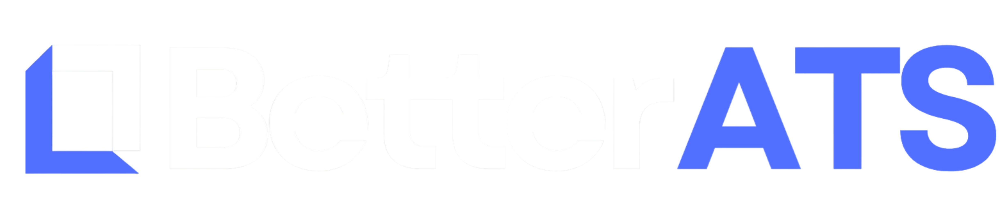

<div align="center">



# BetterATS

### AI-Powered Applicant Tracking System
**Hire for talent and potential, not just keywords.**

[](https://nextjs.org/)
[](https://www.typescriptlang.org/)
[](https://reactjs.org/)
[](https://tailwindcss.com/)

[](https://www.prisma.io/)
[](https://www.postgresql.org/)
[](https://supabase.com/)
[](https://opensource.org/licenses/MIT)

<p align="center">
  <a href="#key-features"><strong>Features</strong></a> •
  <a href="#technology-stack"><strong>Tech Stack</strong></a> •
  <a href="#getting-started"><strong>Getting Started</strong></a> •
  <a href="#development"><strong>Development</strong></a> •
  <a href="#license"><strong>License</strong></a>
</p>

</div>

---

<br/>

## Introduction

<div align="center">
  <a href="https://www.youtube.com/watch?v=dGjOEzMp-AQ">
    
  </a>
  <p><em>Click to watch our introduction video</em></p>
</div>

<br/>

betterATS revolutionizes recruiting by replacing outdated keyword matching with semantic AI analysis. Our platform uses large language models to comprehensively analyze resumes, cover letters, and application responses against job requirements, providing recruiters with intelligent candidate rankings based on true fit and potential rather than resume buzzwords.

## The Problem

Traditional ATS systems rely on keyword matching, leading to qualified candidates being overlooked and unqualified ones ranking high. Recruiters spend countless hours manually reviewing applications, and the best candidates often get filtered out by rigid keyword algorithms that can't understand context, experience, or potential.

## The Solution

betterATS leverages advanced AI to perform semantic analysis of entire applications. The system evaluates candidates holistically - analyzing their resume, cover letter, portfolio, and responses - against job requirements and recruiter-defined private directions. This results in rankings that reflect actual candidate quality and fit, not just keyword density.

## Key Features

- **Semantic Analysis**: LLM-powered evaluation of resumes, cover letters, and application materials
- **Intelligent Ranking**: AI-driven candidate sorting based on comprehensive analysis, not keywords
- **Private Directions**: Recruiters can define hidden filtering criteria that influence rankings
- **Comprehensive Insights**: Detailed strong points, weak points, and recruiter remarks for each candidate
- **Pipeline Management**: Visual candidate pipeline with drag-and-drop stage management
- **Custom Application Forms**: Flexible job application forms with custom questions and knockout criteria

## Technology Stack

- **Framework**: Next.js 16, React 19, TypeScript
- **Database**: PostgreSQL with Prisma ORM
- **Authentication**: Supabase Auth
- **AI**: Anthropic Claude & OpenAI
- **Storage**: Supabase Storage for resume PDFs
- **Styling**: Tailwind CSS

## Getting Started

### Prerequisites

- Node.js 20+
- PostgreSQL database
- Supabase account (for authentication and storage)
- Anthropic API key or OpenAI API key

### Installation

```bash
# Clone the repository
git clone <repository-url>
cd better-ats

# Install dependencies
npm install

# Set up environment variables
cp .env.example .env
# Edit .env with your configuration

# Set up the database
npx prisma migrate dev
npx prisma generate

# Run development server
npm run dev
```

### Environment Variables

```env
DATABASE_URL="postgresql://..."
NEXT_PUBLIC_SUPABASE_URL="https://..."
NEXT_PUBLIC_SUPABASE_ANON_KEY="..."
SUPABASE_SERVICE_ROLE_KEY="..."
ANTHROPIC_API_KEY="..." # or OPENAI_API_KEY="..."
```

## Development

```bash
# Development server
npm run dev

# Database migrations
npm run db:migrate

# Database studio
npm run db:studio

# Build for production
npm run build
npm start
```

## License

MIT License
